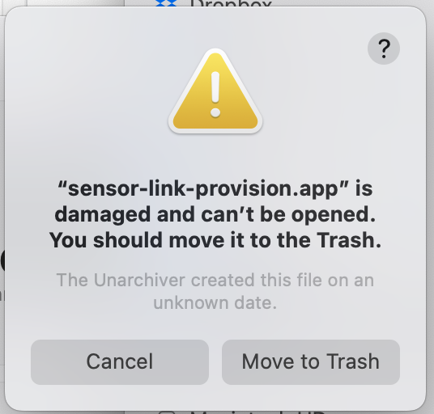
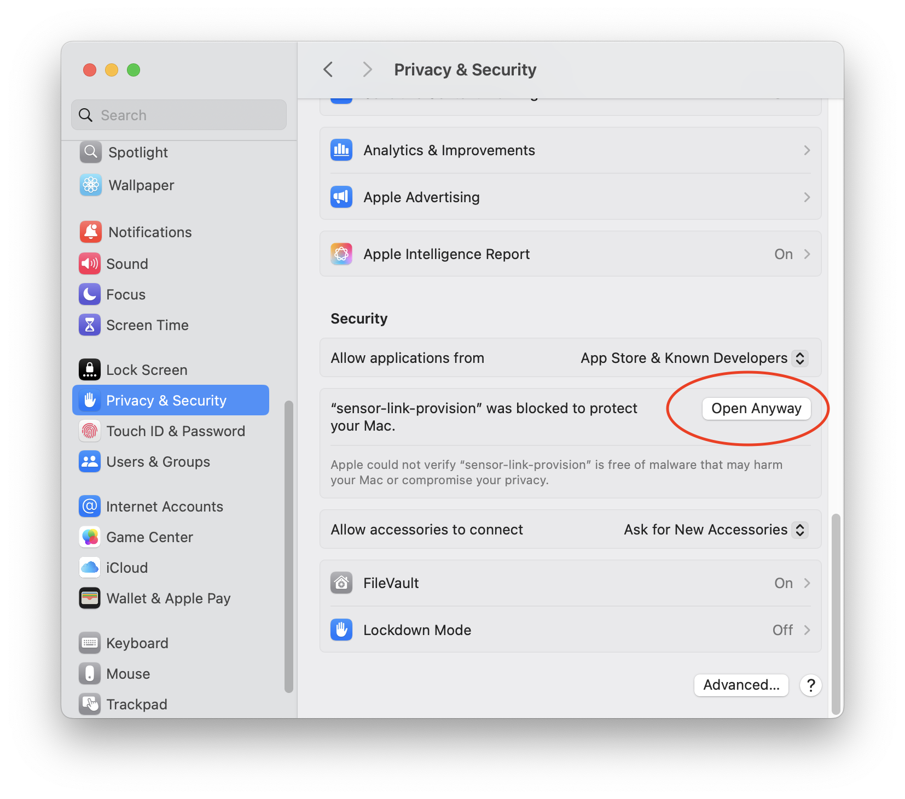

# sensor-link-provision

Desktop tool for provisioning sensor-link devices on a production PC. One
binary, no toolchain or vendor software: it flashes the bootloader, the
firmware and the per-device config (UID, client certificate, private key)
over a J-Link, signs each device certificate with the project CA held on a
YubiKey, checks the boot log over RTT, and keeps a CSV issuance log.

Everything project-specific comes from a `provision.toml` inside the firmware
release zip, so the same binary serves every sensor-link product.

## Operator quick start

1. Plug in the J-Link (REDFIT/SKEDD cable to the board) and the YubiKey.
   Power the board from its own supply; the probe does not power it.
2. Start `sensor-link-provision`, select the firmware release zip
   (`firmware-build-<run>.zip` from the project's *Firmware Release Build*
   workflow), pick the device variant, check the log path, enter the
   YubiKey PIV PIN, *Start session*.
3. Per device: scan the UID barcode, scan the SIM barcode (ICCID), wait for
   the sound. Green OK = done; orange UNVERIFIED = flashed and logged but the
   boot log did not show the UID (re-provision if it does not work); red
   FAIL = not provisioned, retry the same UID.
4. *End session* shows the counts and the project's reminder (for example,
   registering the SIM ICCIDs).

The session start checks the PIN once (three wrong PINs lock the PIV
applet), reads the CA certificate from the slot, and signs a throwaway test
certificate to prove the slot key matches the CA before any device is
touched.

## Installing

Download the build for your platform from the *Provisioning tool* workflow
artifacts in this repository: `sensor-link-provision-macos-arm64` (a zipped
`sensor-link-provision.app`) and `sensor-link-provision-linux-x86_64` (a bare
binary).

### macOS

Unzip and move `sensor-link-provision.app` to Applications. The app is not
notarised, so the first launch is blocked by Gatekeeper:

1. Double-click the app. macOS refuses to open it:

   

   Click **Cancel** (do *not* move it to the Trash).

2. Open **System Settings -> Privacy & Security**, scroll to **Security**, and
   click **Open Anyway** next to the `sensor-link-provision` entry:

   

   Confirm with your password/Touch ID. The app opens, and macOS remembers the
   choice for future launches.

Command-line alternative (does the same thing without the dialogs):

```sh
xattr -dr com.apple.quarantine /Applications/sensor-link-provision.app
```

### Linux (Debian/Ubuntu)

```sh
sudo apt install pcscd libpcsclite1 libgtk-3-0 libasound2
sudo systemctl enable --now pcscd
# USB access to the J-Link without root:
sudo curl -o /etc/udev/rules.d/69-probe-rs.rules https://probe.rs/files/69-probe-rs.rules
sudo udevadm control --reload && sudo udevadm trigger
sudo usermod -aG plugdev $USER   # log out and in again
```

## The profile: `provision.toml`

Ship this file in the release zip next to the bootloader and firmware ELFs
(they must be ELF files; `.bin`/`.b64`/`.cdx.json` siblings are ignored).

```toml
version = 1                  # provision.toml schema version

[project]
name = "Acme Heat Meter"

# One entry per flashable variant; the operator picks one per session.
[[variants]]
name = "Heat meter"
device_type = 0              # wire byte of the firmware's DeviceType
firmware = "heatmeter-*"     # glob on file names in the zip

[artifacts]
bootloader = "bootloader-*"

[target]
chip = "STM32L4R5ZITx"       # probe-rs target name
swd_speed_khz = 4000         # optional, default 4000
config_flash_start = 0x081FE000
config_flash_end = 0x08200000
rtt_address = 0x2009FF00     # fixed RTT control block address
boot_banner = "# Starting"   # optional; UID must appear after the last banner
rtt_timeout_s = 10           # optional

[identity]
uid_min = 5                  # accepted UID length range; a scan outside it
uid_max = 9                  # warns (with override), capped at the firmware limit
cert_subject = { OU = "Devices", O = "Acme", C = "NL" }
cert_validity_days = 9650
ca_piv_slot = "R1"           # retired slot R1..R20, or hex 82..95

[session]                    # optional
default_log = "~/acme-provisioning/issuance.csv"
exit_note = "Enter the SIM ICCID of each new device in the dashboard."
```

Device certificates get subject `<cert_subject>, CN=<UID>`, a random
16-byte serial, `basicConstraints CA:FALSE`, `keyUsage
digitalSignature,nonRepudiation`, `extendedKeyUsage clientAuth` and an
`authorityKeyIdentifier`, signed with ecdsa-with-SHA256. The device key pair
is ECDSA P-256, generated in memory and never written to disk.

## CA on the YubiKey

The CA private key lives in a PIV retired slot (`ca_piv_slot`); the CA
certificate should be imported into the same slot so the tool can read it.
If the slot holds no certificate, the setup screen accepts a CA certificate
PEM file instead. [YUBIKEY_SETUP.md](YUBIKEY_SETUP.md) is the full one-time
procedure (hardening, key import, verification).

## Issuance log

CSV, one row per provisioned device, written before the RTT check:

```
datetime_utc,uid,sim_icc,cert_serial,cert_sha256
```

Re-provisioning a UID already in the log asks for confirmation and appends a
new row. Failed devices are not logged.

## Testing without a YubiKey

A development CA from files replaces the YubiKey; the GUI shows an orange
"DEVELOPMENT CA" banner on both screens and asks for no PIN. Only available
from the command line so it cannot be picked by accident in production:

```sh
openssl ecparam -name prime256v1 -genkey -noout -out dev_ca.key
openssl req -x509 -new -key dev_ca.key -sha256 -days 3650 -subj "/O=Dev/CN=dev_ca" -out dev_ca.pem
sensor-link-provision --dev-ca-key dev_ca.key --dev-ca-cert dev_ca.pem
```

Devices provisioned this way only connect to a broker that trusts `dev_ca.pem`.

## Command-line checks

For bring-up without the GUI:

```sh
# Sign and verify a test certificate with the YubiKey CA (asks for the PIN)
sensor-link-provision --selftest-sign --zip firmware-build-31.zip
# Flash a board with a throwaway identity and print the RTT boot log
sensor-link-provision --flash-test --zip firmware-build-31.zip --variant 0 --uid TEST00001
```

## Building

```sh
cargo build --release -p sensor-link-provision
```

Linux build dependencies: `libudev-dev libpcsclite-dev libasound2-dev
libgtk-3-dev pkg-config`.
